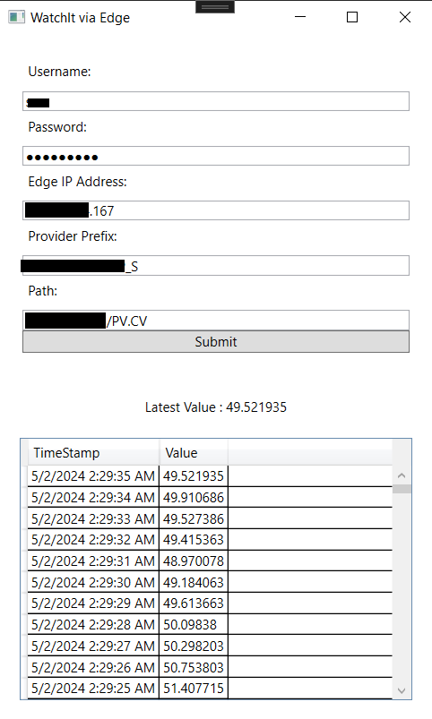

# DeltaV Edge Environment REST API Implementation in a Simple WPF Application

This implementation demonstrates how to utilize the DeltaV Edge Environment REST API within a straightforward WPF (Windows Presentation Foundation) application. The purpose of this application is to interact with the DeltaV Edge system and retrieve relevant data.

## Instructions:

1. **DeltaV Edge Credential**: Insert your valid DeltaV Edge credentials.
2. **Edge IP Address**: Provide the IP address of your DeltaV Edge system.
3. **Provider Prefix/System Name**: Locate this information in the `{api/v1/graph}` endpoint.
4. **Parameter Path**: Specify the desired parameter path.

Upon clicking the "Submit" button, the application will retrieve the latest value for the specified parameter, along with its historical data.
## Download the Application:

You can download the complete WPF application as a zip file from the following link: Download DeltaV Edge WPF App  
[Download here](https://github.com/EmersonDeltaV/deltav-edge-watchit/releases/tag/Release)
## Preview   
